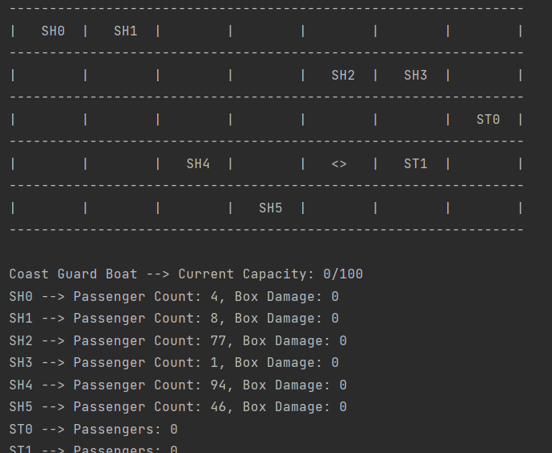
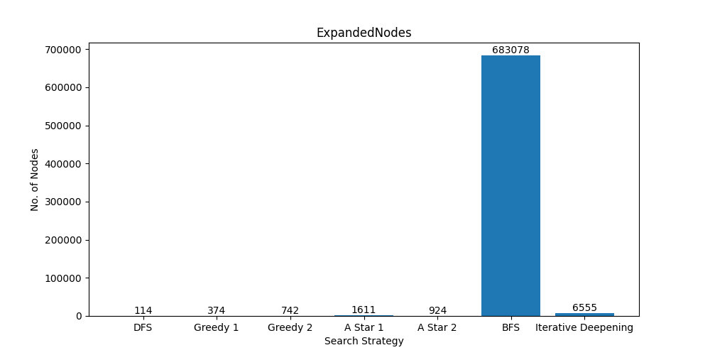
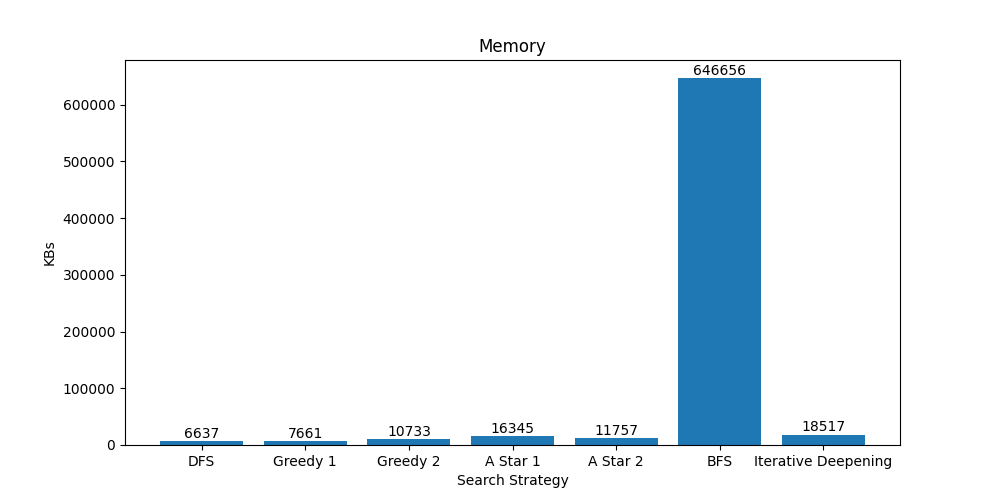
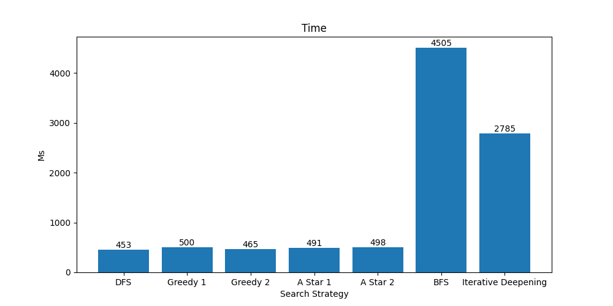
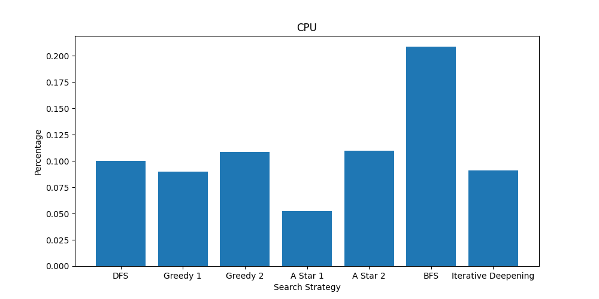

# AI Project 1 Report

# The problem

This problem is called the Coast Guard Problem.
In this problem we have an agent which is a coast guard boat located in some location inside a 2D grid that represents the sea. In this grid we have some randomly located ships and stations. These ships have passengers on them as well as a black box on each ship. The agent’s job is to move inside the grid, saves the passengers of these ships and drop them off at the stations as well as retrieving the black boxes. However, there are some constraints in this problem. Every time the agent (boat) commits an action (e.g., moving, retrieving, dropping), the number of passengers on all ships is decreased by one. If a ship has no passengers, only then the agent is allowed to retrieve its black box as long as it’s not damaged (the black box is damaged if the agent commits 20 actions after the ship loses its all passengers). Our goal here is to search for a goal state for the world, meaning there are no more passengers to save and there are no more black boxes to retrieve. This is how this problem appears to be a search problem which we will be trying to solve using different search strategies.

# Search-tree node ADT

The `Node` ADT is the building block of our problem search tree. It mainly represents our state in the problem, and it contains the following as attributes:

- `state` to represent the current state of the problem.
- `parentNode` to represent the parent of the current node.
- `generatingOperator` to represent the action/operation that led to this node.
- `depth` represents the depth of the node in the problem search tree.
- `pathCostFromRoot` to represent the path cost to reach this node from the root.

# Search problem ADT

The `Problem` is an abstract class that represents a general search problem. It contains the following attributes:

- `initialState` of type `State` to represent the initial state of the search problem.
- `operators` to represent the list of available operators (of type `Operator` ) or actions in the search problem.
- `int pathCost(State state)` an abstract method that given a state in the search problem, returns the path cost from the root until this state.
- `boolean isGoalState(State state)` an abstract method that given a state, returns a boolean indicating whether the state represents a goal state or not.
- The state space of the problem is to be generated while expanding the different nodes or states in the search problem.

# CoastGuard class

The `CoastGuard` class is a child class of the `Problem` class. It contains the following:

- This class by default will have the previously mentioned attributes of the super class (e.g., `Problem` class) and it will also implement all its abstract methods (e.g., `pathCost`, `isGoalState`) (mentioned in the ***Main classes and methods*** section).
- `static String solve(String grid, String strategy, boolean visualize)` as mentioned in the description, this method should solve the search problem according to the given strategy. We implemented this method to use the generic `search` method in the generic `Search` class (mentioned in the ***Main classes and methods*** section).
- `static String genGrid()` as mentioned in the description, this method randomly generates a coast guard problem using the given constraints mentioned in the description.

---

# Main classes and methods

## Search Class:

The `Search` ADT is an abstract class, and it is considered the super class of all search strategies classes (e.g., `BFS`, `DFS`, `Greedy`, `AStar` and `IterativeDeepenging`). It contains the following attributes:

- `seachQueue` this is of type `SearchQueue` which will be used for enqueuing and dequeuing during the search.
- `expandedNodes` is an integer to represent the number of expanded nodes during the search.
- `Node search(Problem p)` which is a generic method that takes a problem and apply the searching on it and returns a node that represents a goal state.
- `Node search(Problem p, int maxDepth)` this is an overloaded method of the generic method `search` , mainly used for the iterative deepening search because it works the same as different search strategies but requires a max depth each iteration.

<aside>
💡 This method will be used to implement the logic of the searching for all strategies as all search strategies follow the same algorithm. However, they only differ in the queuing behaviour, and this is why each search strategy class will use this generic method `search`but using their own `searchQueue`.
Look into the implementation of the following classes for more details `BFS`, `DFS`, `Greedy`, `AStar` and `IterativeDeepenging`.

</aside>

## Search Mechanism:

The class `Search` is the superclass of all the search strategies and has the method `search` which is an implementation of the general search procedure as discussed above. The direct subclasses of `Search` are `BFS`, `DFS` and `InformedSearch`. What we do in these subclasses is assigning the `searchQueue` to the proper type to do the search in a specific manner. In `BFS`, we set `searchQueue` to be a FIFO queue and in `DFS`, we set it to a stack and in `InformedSearch`, we set it to a priority queue. `InformedSearch` has 2 subclasses: `Greedy` and `AStar` which are different only in the comparator of the priority queue which is set in the constructor of each of them. `DFS` has one subclass which is `IterativeDeepening` since it also uses a stack. In `IterativeDeepening`, we override the method `search` to be a loop that iterates on different depths increasingly and calls the overloaded version of its superclass -DFS-: `search(Problem p, int maxDepth)` which is basically “Depth Limited Search” until it finds a solution.

We make use of dynamic polymorphism in java to apply different search strategies with the same method invocation. in the static method `CoastGuard.solve()`, we declare an object with the reference type `Search` and then instantiate it based on the input string `strategy`. We then invoke the method `search` and the chosen strategy is applied automatically.

## Answer Construction:

The method `search` returns a search tree node which is traversed backwards using the pointer `parentNode` and storing the generating operators in a stack in a reversed manner. The strings in the stack are then popped and concatenated in a single string to construct the plan in the correct order. Number of expanded nodes is stored in the `search` object. Other information regarding the deaths and damaged boxes can be retrieved also from the state of the result node.

## Path cost and heuristics

### Path cost**********************:**********************

$$
\begin{align}
   pathCost &= deadPassengers * 1000 + damagedBlackBoxes
\end{align}
$$

This equation of the path cost takes into count the number of dead passengers as well as the number of damaged boxes. However, it gives more weight to the number of dead passengers more than the number of damaged boxes. This, given the constraint of the problem, will ensure giving the priority to saving passengers than retrieving black boxes.

### **Heuristic 1:**

Our first heuristic calculates an estimation for how many passengers will die and how many boxes will be damaged going from the current state to one of the goal states. The estimation of the number of dead passengers is based on the following observation: if we want to save some passengers, we must approach one of the non-wreck ships. If the agent decides to go to any of them, any ship that has alive passengers onboard will lose as many passengers as steps needed to go to that ship. To be admissible, we choose the nearest ship that has alive passengers and calculate the distance between it and the agent. Then, we multiply this distance by the number of ships that have alive passengers:

$$
dis = \text{Distance to the nearest ship with alive passengers}\\
ships = \text{Number of ships with alive passengers onboard}\\
estimatedDeaths = dis * ships
$$

To guarantee admissibility, we do one additional step. Since there could be a ship or more that has alive passengers less than the number of the steps needed by the agent to go to the nearest ship, we could overestimate the cost. Therefore, we tweak the estimation a bit to account for such cases:

$$
dis = \text{Distance to the nearest ship with alive passengers}\\
minPassengers = \text{Minimum number of passengers on a ship}\\
ships = \text{Number of ships with alive passengers onboard}\\
estimatedDeaths = Min(dis, minPassengers) * ships
$$

What remains is to calculate an estimation for the damaged black boxes. Our estimation is that if there is a ship at a distance that is greater than or equal the needed time for its box to be damaged, then its box will be damaged inevitably. We estimate the number of damaged black boxes as follows:

$$
estimatedDamagedBoxes =\\ |\{ship |(\neg Wreck(ship) \land distance(guard,ship) \geq passengers(ship) + 20) \\\lor (Wreck(ship) \land distance(guard,ship) \geq 20 - damage(box(ship)))\}|
$$

Finally, we combine both estimations in the same way we did with the path cost:

$$
estimatedCost = estimatedDeaths * 1000 + estimatedDamagedBoxes
$$

### ************************Heuristic 2:************************

The second heuristic is a slight improvement on the first one in terms of estimated deaths. Instead of assuming that every ship has the minimum number of passengers, we treat every ship individually and see how many passengers on it will die if the agent goes to the nearest ship. Therefore, the estimated deaths equation becomes:

$$
estimatedDeaths = \displaystyle\sum_{ship \in ShipList}{Min(passengers(ship), Max(dis, minPassengers))}
$$

$dis$ and $minPassengers$ have the same semantics discussed in the previous heuristic. The estimation of the damaged boxes is the same and the equation of the final calculation is also the same as above.

## Goal state

We consider a state as a goal state if there are no more alive passengers on any ship and there are no more retrievable black boxes to retrieve and there are no more passengers left on the coast guard boat to drop.

---

# Performance

## Specifications

The performance of the implemented search algorithms were tested on a PC of the following specifications:

| Processor | Intel(R) Core(TM) i7-9750H CPU @ 2.60GHz 2.59 GHz |
| --- | --- |
| Ram | 16 GB |
| System Type | 64-bit operating system, x64-based processor |
| OS | Windows 10 Pro |

The test was conducted on the following string: `7,5;100;3,4;2,6,3,5;0,0,4,0,1,8,1,4,77,1,5,1,3,2,94,4,3,46;`

---

## Testing Results

### Expanded Nodes

As shown in the graph, the BFS is overcoming the rest of the strategies. This can be explained due to the fact that this search strategy expands every level before start exploring the next level. However, the DFS has the least number of expanded nodes. In this particular problem the goal state can be achieved as time passes. Consequently, the DFS can expand deep states and achieve its goal easily without having to backtrack to other branches. But this strategy can easily sacrifice the number of rescued people.

Since $A*_2$ dominates $A*_2$ , $A*_1$  expands less number of nodes compared to $A*_2.$

### Memory

Java ****************Runtime**************** library provides an approximation for the measuring the memory usage of a Java process. Two methods were provided to measure the memory usage:  `Runtime.*getRuntime*().freeMemory();` and `Runtime.*getRuntime*().totalMemory();`. Used memory can be calculated by subtracting $totalMemory - freeMemory$. 

As a consequence of exploring huge the number of nodes, the ********BFS******** is consuming a large amount of memory. The amount of used memory is directly proportional to the expanded nodes.

### Execution Time

Java runtime provides an API to get the current runtime. This was calculated by computing the time before and after the search.

Since the **************BFS************** expanding a huge number of nodes during the search process, the ********BFS******** has the longest execution time. The rest of the strategies is having an execution time relative to the number of expanded nodes.

### CPU Utilization

The`java.lang.management.ManagementFactory` provides a function to measure the utilization of the running Java process. Since the utilization of the CPU is varying as time passes, the overall utilization was calculated by calculating the average of utilizations that were measured after expanding 10000 nodes. This is number is relatively high to decrease the number of measurements, this is because measuring the utilization is an expensive task.

The utilization of the CPU is relative to the number of expanded nodes.

### Optimality and Completeness

**********BFS:********** It is not optimal in general and not guaranteed to return the goal state with the least cost but it is complete and guaranteed to find a goal state if there is one since the arity of the search tree is finite.

**********DFS:********** It is not optimal since it returns the first answer it finds in one of the branches it traverses deeply which could not be the best answer in terms of cost. It is complete in this problem since there are not branches that are infinitely deep.

******************************************Iterative Deepening:****************************************** It is complete and guaranteed to find an answer if there is one but not optimal for the same reasons DFS is not optimal.

****************Greedy:**************** It is complete and guaranteed to find a goal state since the state space is finite but not optimal in general since the heuristic alone is not an exact estimate of the actual cost.

********A*:******** It is complete and guaranteed to find a goal state if there is one and also optimal given that the heuristic function is admissible as discussed in class.

---

# Reference

- `SearchQueue` is an interface which the child search strategies classes will implement, each differently according to the behaviour each one should have for its queue attribute (e.g., `DFSQueue`, `BFSQueue`, etc.).
- Matplotlib library was used to generate the charts of the performance.

[Matplotlib](https://matplotlib.org/)
